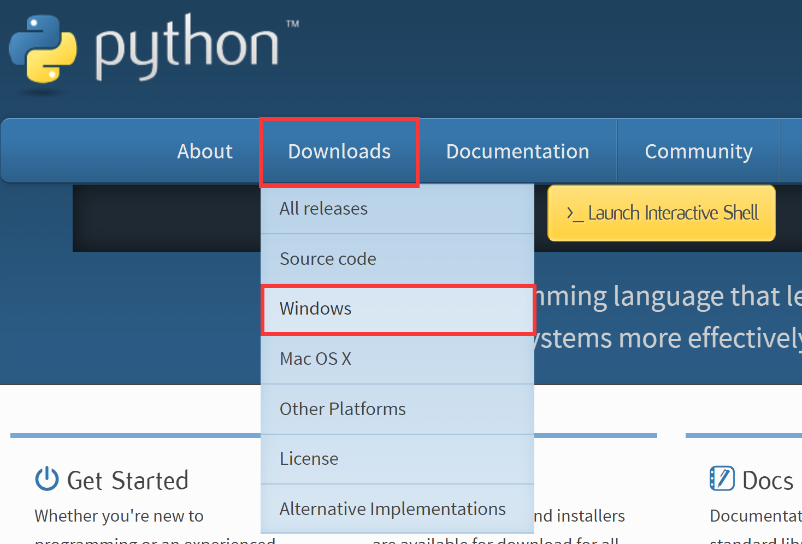
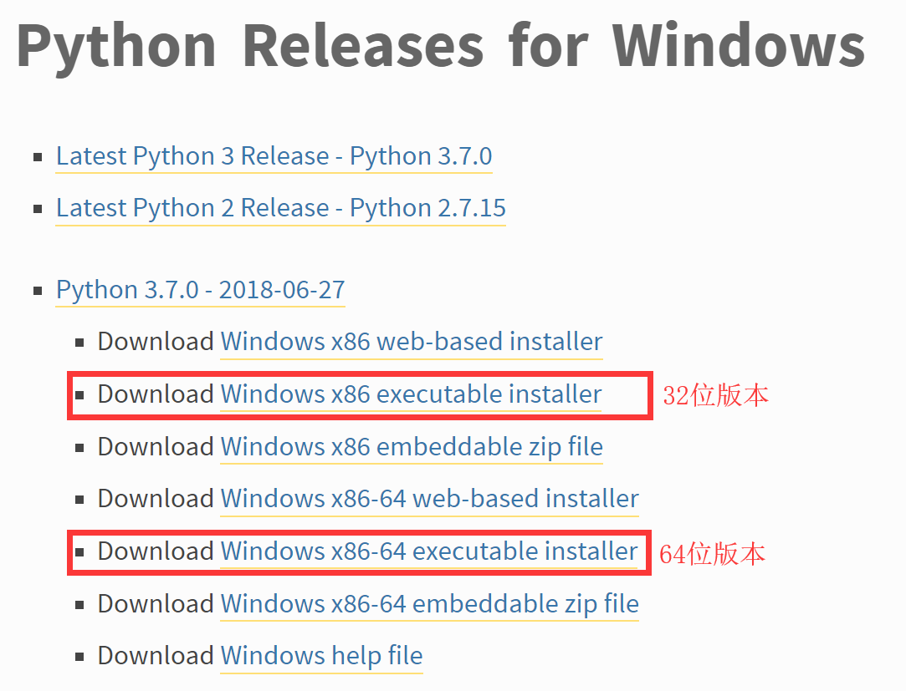
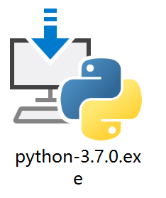
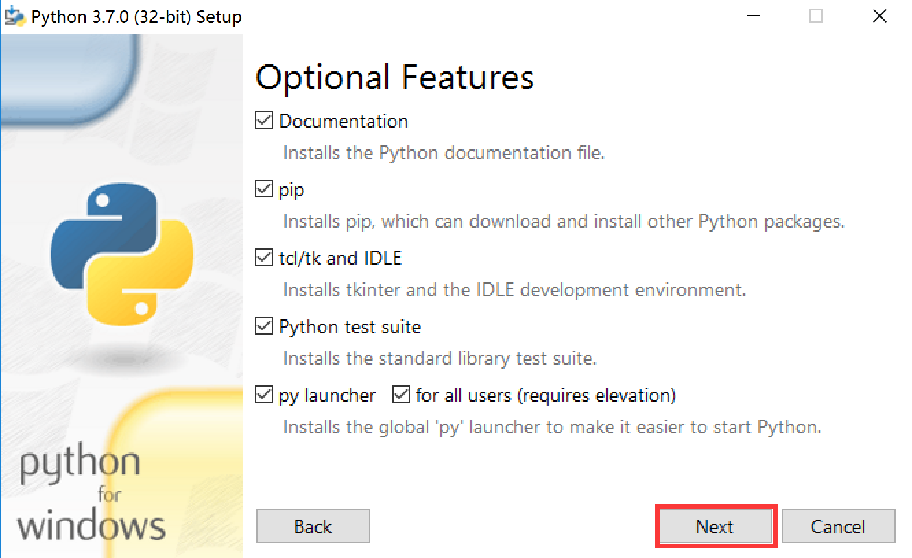
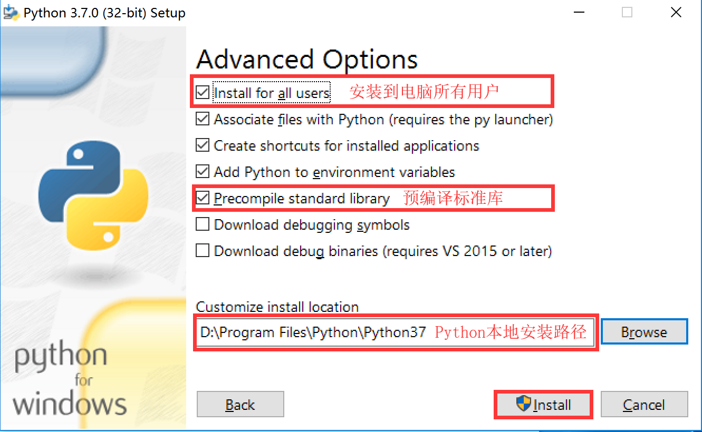
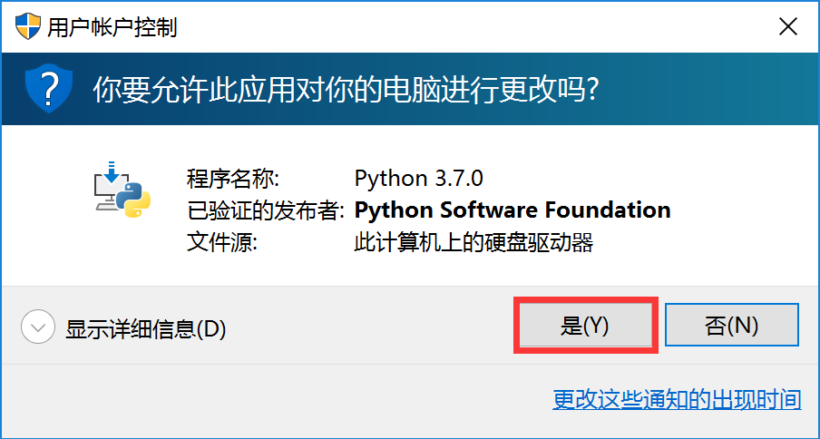
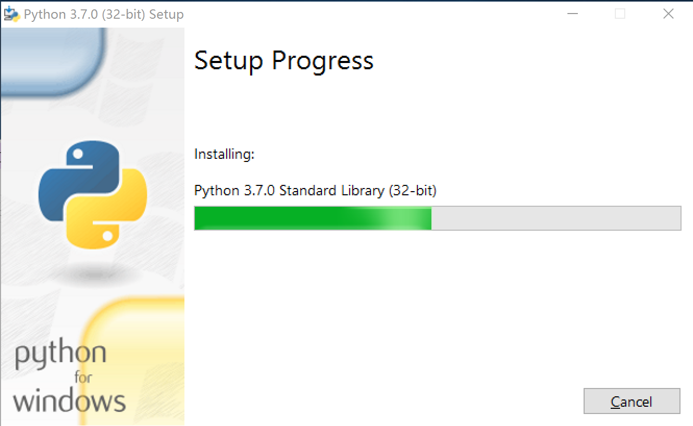
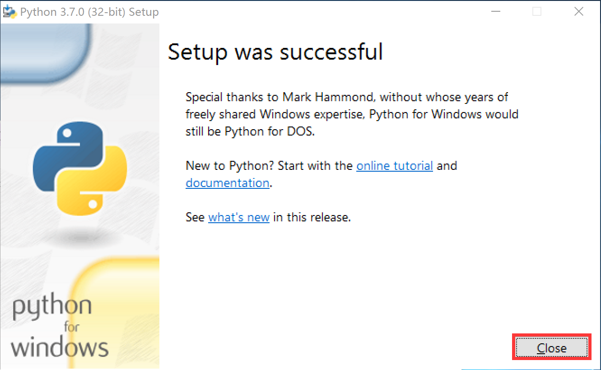
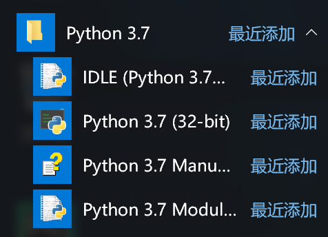

 

# Python在Windows系统下的安装

#### 1. 进入Python官网（[https://www.python.org/](https://www.python.org/)），选择`Downloads`菜单下的`Windows`选项。

 

#### 2. 在弹出的网页中，选择Python3（Python3.x.x开头即可)的`Windows XXXX executable installer`版本，32位或64位根据电脑系统决定。

 

#### 下载完成后可得到如下文件。

 

#### 3. 双击安装文件，勾选`Add Python 3.7 to PATH（将Python安装路径添加到系统路径下）`，然后点击`Customeize installation`进行自定义安装。

 

#### 4. 在可选项窗口中，如无特殊需求则全部进行选择，点击`Next`按钮。

 

#### 5. 在高级选项窗口中，勾选`Install for all user（安装到电脑所有用户）`与`Precomplile standard library（预编译标准库）`选项，并在`Customize install location`选择Python安装的本地路径，并点击`Install`按钮进行安装。

 

#### 6. 在弹出的是否允许修改窗口中点击`是(Y)`按钮，并等待安装完成。

 

 

#### 7. 安装完成之后点击`Close`按钮关闭窗口，此时在程序列表中能够看到Python已安装完成。

 

 

